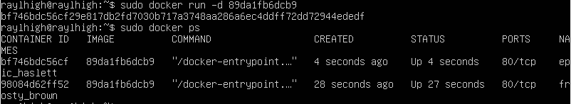
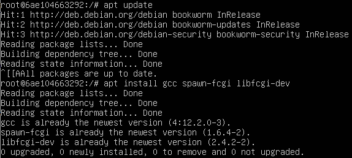

# Simple Docker

Введение в докер. Разработка простого докер образа для собственного сервера.

1. [Готовый докер](#part-1-готовый-докер)
2. [Операции с контейнером](#part-2-операции-с-контейнером)
3. [Мини веб-сервер](#part-3-мини-веб-сервер)
4. [Свой докер](#part-4-свой-докер)
5. [Dockle](#part-5-dockle)
6. [Базовый Docker Compose](#part-6-базовый-docker-compose)

## Part 1. Готовый докер

- `apt install docker.io`

##### Взять официальный докер образ с **nginx** и выкачать его при помощи `docker pull`

- `sudo docker pull nginx`

##### Проверить наличие докер образа через `docker images`

- `sudo docker images`

##### Запустить докер образ через `docker run -d [image_id|repository]` и проверить, что образ запустился через `docker ps`

- `sudo docker run -d [image_id|repository]` 

- `sudo docker ps`

##### Посмотреть информацию о контейнере через `docker inspect [container_id|container_name]`

- `sudo docker inspect [container_id|container_name]`

##### По выводу команды определить и поместить в отчёт размер контейнера, список замапленных портов и ip контейнера

- размер контейнера `sudo docker inspect [container_id|container_name] | grep -i ShmSize`

- список замапленных портов `sudo docker inspect [container_id|container_name] | grep -i -A 2 dPorts`

- ip `sudo docker inspect [container_id|container_name] | grep -i ip`

##### Остановить докер образ через `docker stop [container_id|container_name]`

- `sudo docker stop [container_id|container_name]`

##### Проверить, что образ остановился через `docker ps`

##### Запустить докер с портами 80 и 443 в контейнере, замапленными на такие же порты на локальной машине, через команду *run*

- `sudo docker run -d -p 80:80 -p 443:443 nginx`

##### Проверить, что в браузере по адресу *localhost:80* доступна стартовая страница **nginx**

- у меня ubuntu lts, браузера не будет, но по пингу понято, что конект есть.

##### Перезапустить докер контейнер через `docker restart [container_id|container_name]`

- `sudo docker restart [container_id|container_name]`

##### Проверить любым способом, что контейнер запустился

## Part 2. Операции с контейнером

##### Прочитать конфигурационный файл *nginx.conf* внутри докер контейнера через команду *exec*

- `sudo docker exec [container_id|container_name] cat /etc/nginx/nginx.conf`

##### Создать на локальной машине файл *nginx.conf*

- `touch nginx.conf `

##### Настроить в нем по пути */status* отдачу страницы статуса сервера **nginx**

- За основу я беру файл **nginx.conf** из контейнера.

##### Скопировать созданный файл *nginx.conf* внутрь докер образа через команду `docker cp`

- `sudo docker cp nginx.conf 682b5a4098d4:/etc/nginx/`

##### Перезапустить **nginx** внутри докер образа через команду *exec*

- `sudo docker exec 682b5a4098d4 nginx -s reload`

##### Проверить, что по адресу *localhost:80/status* отдается страничка со статусом сервера **nginx**

- `curl localhost:80/status`

- общий скрин, 4 заданя.

##### Экспортировать контейнер в файл *container.tar* через команду *export*

- `sudo docker export 682b5a4098d4 > container.tar`

##### Остановить контейнер

- `sudo docker stop 682b5a4098d4`

- общий скрин, 2 заданя.

##### Удалить образ через `docker rmi [image_id|repository]`, не удаляя перед этим контейнеры

##### Удалить остановленный контейнер

##### Импортировать контейнер обратно через команду *import*

- ["nginx", "-g", "daemon off;"] гарантирует, что Nginx останется «на переднем плане», так что Docker сможет правильно отслеживать процесс (в противном случае контейнер остановится сразу после запуска)

##### Запустить импортированный 

- `sudo docker run -d -p 80:80 -p 443:443 f30c3d1adb02`

##### Проверить, что по адресу *localhost:80/status* отдается страничка со статусом сервера **nginx**

- `curl localhost:80/status`

## Part 3. Мини веб-сервер

##### Написать мини сервер на **C** и **FastCgi**, который будет возвращать простейшую страничку с надписью `Hello World!`

##### Написать свой *nginx.conf*, который будет проксировать все запросы с 81 порта на *127.0.0.1:8080*

##### Запустить написанный мини сервер через *spawn-fcgi* на порту 8080

- cоздаем контейнер с портом 81

- копирую файлы в контейнер

- `sudo docker exec -it nginx1 bash` - зашел в контейнер, а после скачал все необходимое

##### Проверить, что в браузере по *localhost:81* отдается написанная вами страничка

- компилируем, запускаемся, обновляемся и проверяем

##### Положить файл *nginx.conf* по пути *./nginx/nginx.conf* (это понадобится позже)

## Part 4. Свой докер

#### Написать свой докер образ, который:
##### 1) собирает исходники мини сервера на FastCgi из [Части 3](#part-3-мини-веб-сервер)
##### 2) запускает его на 8080 порту
##### 3) копирует внутрь образа написанный *./nginx/nginx.conf*
##### 4) запускает **nginx**.

- Сначала пишем start.sh, в котором записываем команды для ENTRYPOINT. Entrypoint в Dockerfile определяет команды, которые будут запущены при запуске контейнера из образа.

##### Собрать написанный докер образ через `docker build` при этом указав имя и тег

##### Проверить через `docker images`, что все собралось корректно

##### Запустить собранный докер образ с маппингом 81 порта на 80 на локальной машине и маппингом папки *./nginx* внутрь контейнера по адресу, где лежат конфигурационные файлы **nginx**'а (см. [Часть 2](#part-2-операции-с-контейнером))

##### Проверить, что по localhost:80 доступна страничка написанного мини сервера

##### Дописать в *./nginx/nginx.conf* проксирование странички */status*, по которой надо отдавать статус сервера **nginx**

##### Перезапустить докер образ
##### Проверить, что теперь по *localhost:80/status* отдается страничка со статусом **nginx**

## Part 5. **Dockle**

- Скачиваем Dockle

##### Просканировать образ из предыдущего задания через `dockle [image_id|repository]`

##### Исправить образ так, чтобы при проверке через **dockle** не было ошибок и предупреждений

- В Dockerfile был изменен USER с root на nginx
- Был добавлен HEALTHCHECK для проверок образа
- Изменены разрешения для файлов в соответствии с требованием Dockle
- Dockle не понравились ключи nginx, но нам они нужны, поэтому при вызове Dockle-проверки мы сделаем для них исключения
- `export DOCKER_CONTENT_TRUST=1` 
- C ошибкой CIS-DI-0010 можно было разобраться только сменой образа на `Alpine`

- собираем исправленный 

- проверяем

## Part 6. Базовый **Docker Compose**

##### Написать файл *docker-compose.yml*, с помощью которого:
##### 1) Поднять докер контейнер из [Части 5](#part-5-инструмент-dockle) _(он должен работать в локальной сети, т.е. не нужно использовать инструкцию **EXPOSE** и мапить порты на локальную машину)_
##### 2) Поднять докер контейнер с **nginx**, который будет проксировать все запросы с 8080 порта на 81 порт первого контейнера
##### Замапить 8080 порт второго контейнера на 80 порт локальной машины

- Также создаем необходимые файлы чтобы поднять nginx:

##### Остановить все запущенные контейнеры

- `docker system prune -a --volumes`

##### Собрать и запустить проект с помощью команд `docker-compose build` и `docker-compose up`

##### Проверить, что в браузере по *localhost:80* отдается написанная вами страничка, как и ранее

